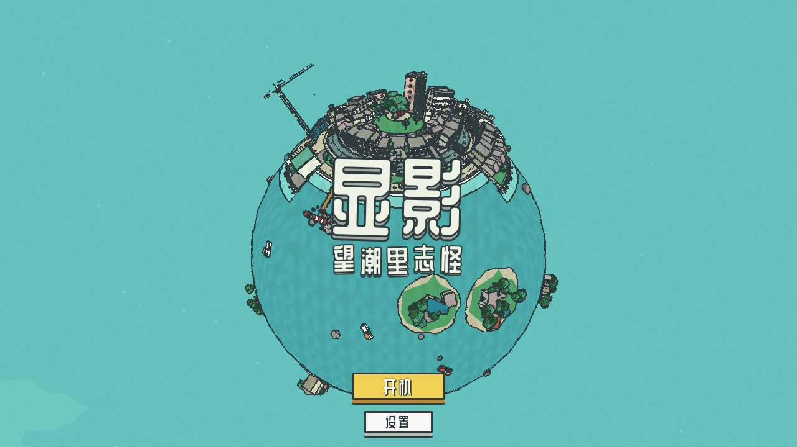
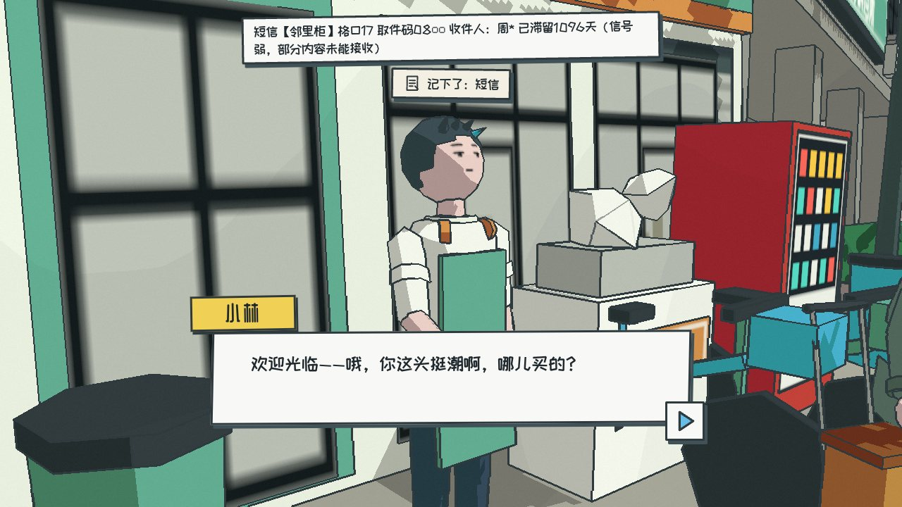
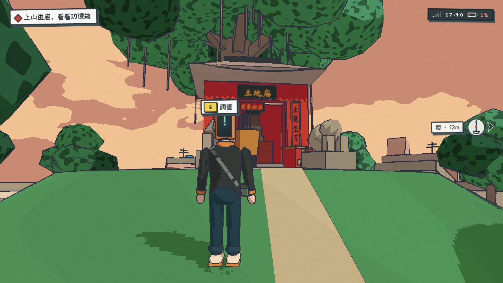
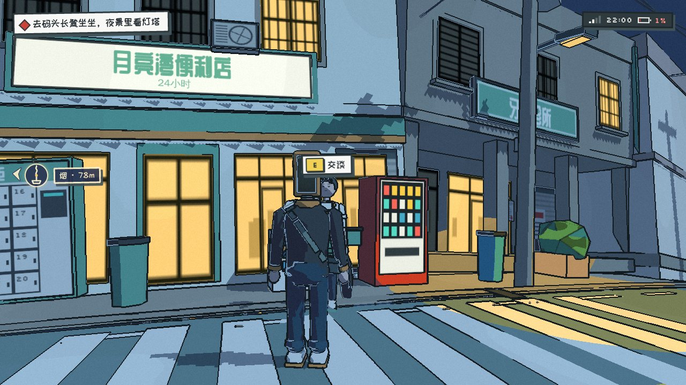

# 《显影》· 望潮里志怪

*XIANYING — Strange Tales of Wangchao Lane*

拆迁前夜，一个脑袋是手机摄像头的男人，用镜头找回自己的脸。

一款在浏览器里玩的小星球都市志怪解谜游戏：没有战斗，只有探索、拍照、找线索和解谜。一周目约 25–35 分钟，有两个结局。画面风格参考 [messenger.abeto.co](https://messenger.abeto.co)：小星球、两段式赛璐璐着色、手绘感墨线、手绘天空。

| | |
|---|---|
|  |  |
|  |  |

- 引擎：three.js r186（`WebGLRenderer`），Vite 8，TypeScript
- 所有美术都由代码程序化生成：几何体、canvas 贴图、GLSL，不含任何外部模型或图片素材
- 字体来自 Google Fonts（ZCOOL QingKe HuangYou、ZCOOL KuaiLe、Long Cang、Ma Shan Zheng、Silkscreen），离线时回退到系统字体

## 运行

需要 Node ≥ 22.12。

```bash
npm ci
npm run dev        # 开发服务器，打开终端里给出的地址
npm run build      # 类型检查并构建到 dist/
npm run preview    # 预览构建结果（http://127.0.0.1:4173）
```

打开页面后点「开机」开始游戏，有存档时可以点「继续」。点击画面可以锁定鼠标。

## 操作

| 按键 | 作用 |
|---|---|
| W A S D / Shift | 走 / 跑 |
| 鼠标 | 转动镜头 |
| E | 交互：调查、交谈、拾取、摘头…… |
| 按住右键，或按 F | 举起镜头（取景） |
| 左键 / 空格 | 快门（按住左键连拍） |
| 滚轮 / 1 2 3 | 变焦 1× / 3× / 10× |
| N / Q / R | 取景中：夜景 / 闪光 / 叠加对照照片 |
| G | 出示照片 |
| Tab / J | 手机：相册 / 备忘录 |
| H | 向土地要提示 |
| Esc | 退出当前层 / 暂停菜单 |

暂停菜单和标题的「设置」里有完整的「操作说明」页。触屏设备会自动启用虚拟摇杆和按钮。

迷路时举起镜头：土地的烟会指向下一个目标，屏幕边缘的香火标记也会指路。

## 开发与测试

```bash
npm run typecheck                 # tsc --noEmit
npm test                          # vitest（src/**/*.test.ts）
npm run check:ids                 # 核对 GDD 里的 id 是否都在代码中定义
npm run e2e                       # 无头 Chromium 冒烟测试（boot 套件）
npm run e2e:golden                # 黄金路径：自动通关到字幕（结局 A；加 --ending B 走结局 B）
npm run e2e:all                   # boot + golden + checkpoints + ui 全部套件
npm run shot -- --base http://127.0.0.1:5173 --url '/?test&skipTitle' --out test-results/x.png
                                  # 单张截图；可用 --do 注入 __game 调用、--act 注入真实键鼠（用法见 scripts/shot.mjs 文件头）
```

端到端测试使用 Playwright 1.63 和 SwiftShader 软件 WebGL（参数见 `scripts/lib/browser.mjs`），整台机器同时最多运行 2 个浏览器。截图和报告输出到 `test-results/`。

常用 URL 参数（完整列表见 `docs/GDD.md` §19.1 和 `docs/ARCHITECTURE.md` §2.10）：

| 参数 | 作用 |
|---|---|
| `?chapter=prologue\|ch1\|ch2\|ch3\|finale` | 直接从某一章开始 |
| `?phase=day\|dusk\|night\|dawn` | 只切换时段和调色 |
| `?at=<spotId>` | 出生在某个点位 |
| `?skipTitle` | 跳过标题画面 |
| `?lowfx=1` / `?dpr=0.75` | 低画质 / 指定像素比 |
| `?mute` | 静音 |
| `?test` | 确定性模式：只由 `window.__game.step()` 推进时间，供测试使用 |

`window.__game` 是调试和测试用的钩子（传送、设置 flag、拍照、读取状态等），生产构建里也保留。

## 目录

```
src/
  core/     运行时核心：小星球数学、玩家、镜头、输入、存档、规则引擎
  render/   赛璐璐材质、MRT + 单次合成（墨线、天空、雾、颗粒）、调色
  audio/    WebAudio 程序化环境音和音效
  world/    望潮里小镇：地形、建筑、道具、碰撞、室内
  chars/    机头人周远、街坊和志怪角色、程序化动画
  lens/     取景、判定 evalShot、变焦/夜景/闪光/对照/出示/摘头
  ui/       标题、对话框、HUD、手机、卡片、菜单
  story/    剧情节拍、谜题、结局、指路的烟
  data/     所有内容数据和中文文本（zh/*）
scripts/    冒烟测试、截图、类型检查等工具
docs/       设计文档
```

## 文档

- `docs/GDD.md`：游戏设计（剧情、谜题、全部台词、id）
- `docs/ART_DIRECTION.md`：美术规范（调色板、着色、墨线、UI）
- `docs/TECH_NOTES.md`：three.js r186 与工具链的技术笔记
- `docs/ARCHITECTURE.md`：代码结构、模块契约、文件归属
- `docs/integration/`：集成与多轮试玩修复的记录（`REPORT.md` 里有检查清单和已知问题）
- `AGENTS.md`：开发中踩过的坑（Lessons）
